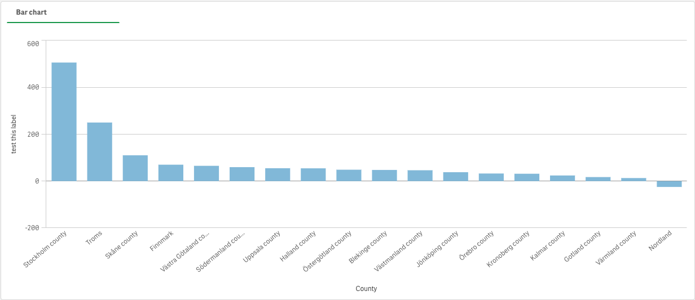

## More Examples

### Container containing a bar chart visualization



```js
nuked.render({
  qInfo: {
    qId: 'AksfrjG',
    qType: 'container'
  },
  qExtendsId: '',
  qMetaDef: {},
  qStateName: '',
  children: [
    {
      refId: 'drVNZNd',
      label: 'Bar chart',
      isMaster: false
    }
  ],
  showTitles: false,
  title: '',
  subtitle: '',
  footnote: '',
  disableNavMenu: false,
  showDetails: false,
  showDetailsExpression: false,
  borders: 'auto',
  showTabs: true,
  useDropdown: true,
  useScrollButton: true,
  showIcons: false,
  activeTab: '',
  defaultTab: '',
  visualization: 'container',
  qChildListDef: {
    qData: {
      visualization: '/visualization',
      containerChildId: '/containerChildId',
      qExtendsId: '/qExtendsId',
      title: '/title',
      showCondition: '/showCondition'
    }
  },
  supportRefresh: false,
  hasExternalChildren: false
});
```
